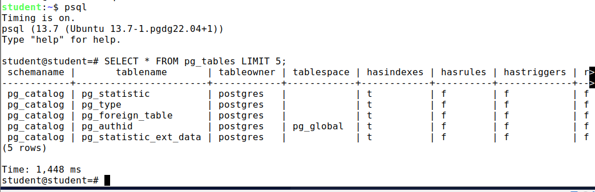

Задание 1 \
\
**psql** \
psql (13.7 (Ubuntu 13.7-1.pgdg22.04+1))\
Type "help" for help.
\
**student=# \conninfo**\
You are connected to database "student" as user "student" via socket in "/var/run/postgresql" at port "5432".\
\
Задание 2 \
**SELECT * FROM pg_tables LIMIT 5;**\
\
schemaname |       tablename       | tableowner | tablespace | hasindexes | hasrules | hastriggers | rowsecurity\
------------+-----------------------+------------+------------+------------+----------+-------------+-------------\
pg_catalog | pg_statistic          | postgres   |            | t          | f        | f           | f\
pg_catalog | pg_type               | postgres   |            | t          | f        | f           | f\
pg_catalog | pg_foreign_table      | postgres   |            | t          | f        | f           | f\
pg_catalog | pg_authid             | postgres   | pg_global  | t          | f        | f           | f\
pg_catalog | pg_statistic_ext_data | postgres   |            | t          | f        | f           | f\
(5 rows)\
\
Задание 3\
**echo "\setenv PSQL_PAGER 'less -XS'" >> ~/.psqlrc**
\
\
\
Задание 4\
\
**echo "\set PROMPT1 '%n@%/%R%x%# '" >> ~/.psqlrc**\
**echo "\set PROMPT2 '%n@%/%R%x%# '" >> ~/.psqlrc**\
\
Задание 5\
**echo "\timing on" >> ~/.psqlrc**\
**cat ~/.psqlrc**\
\setenv PSQL_PAGER 'less -XS'\
\set PROMPT1 '%n@%/%R%x%# '\
\set PROMPT2 '%n@%/%R%x%# '\
\timing on\
\
