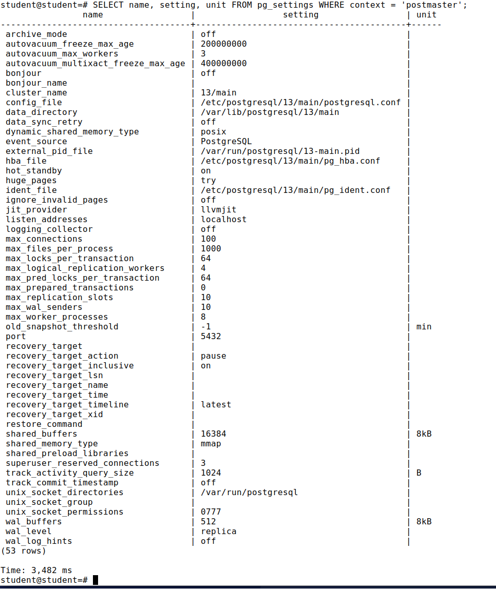
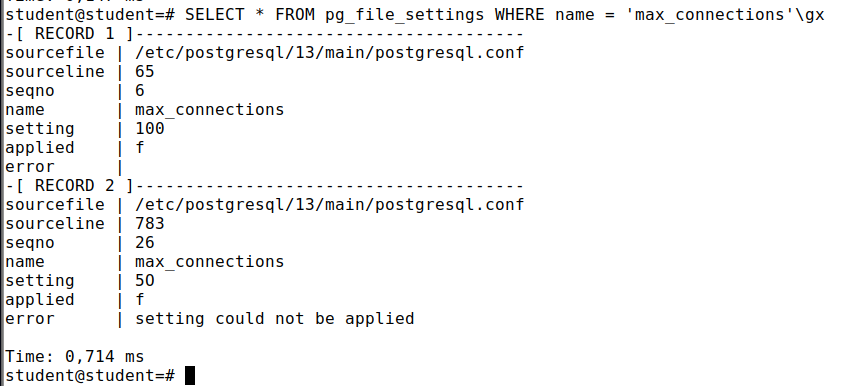

Задание 1\
**SELECT name, setting, unit FROM pg_settings WHERE context = 'postmaster';**\
\
\
**SHOW max_connections;**\
max_connections\
-----------------\
100\
(1 row)\
\
Time: 0,147 ms\
\
Задание 2\
**echo max_connections=5O | sudo tee -a /etc/postgresql/13/main/postgresql.conf**\
\
**sudo pg_ctlcluster 13 main restart**\
Job for postgresql@13-main.service failed because the service did not take the steps required by its unit configuration.\
See "systemctl status postgresql@13-main.service" and "journalctl -xeu postgresql@13-main.service" for details.\
**tail -n 5 /var/log/postgresql/postgresql-13-main.log**/
2024-10-06 13:22:13.586 MSK [1668] LOG:  database system is shut down\
2024-10-06 13:22:13.709 MSK [2956] LOG:  invalid value for parameter "max_connections": "5O"\
2024-10-06 13:22:13.709 MSK [2956] FATAL:  configuration file "/etc/postgresql/13/main/postgresql.conf" contains errors\
pg_ctl: could not start server\
Examine the log output.\
**sudo sed -i 's/5O/50/' /etc/postgresql/13/main/postgresql.conf**\
**sudo pg_ctlcluster 13 main start**\
Timing is on.\
psql (13.7 (Ubuntu 13.7-1.pgdg22.04+1))\
Type "help" for help.\
\
**psql**\
max_connections\
-----------------\
50\
(1 row)\
\
Time: 0,201 ms\
