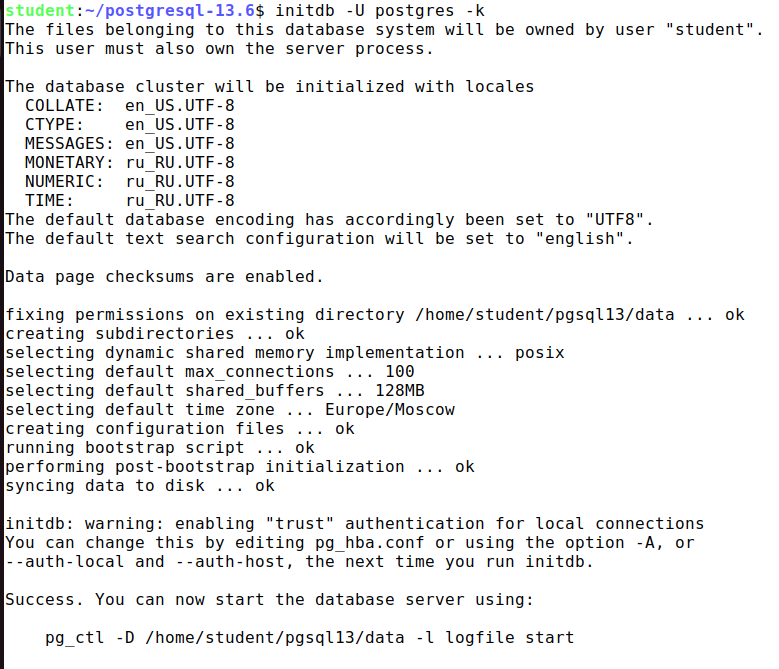
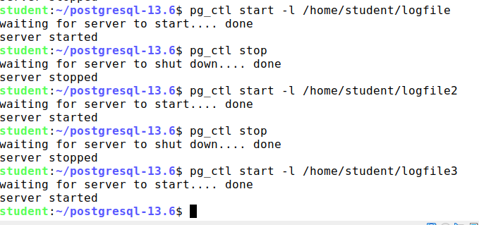

1) tar xzf /home/student/postgresql-13.6.tar.gz распаковка архива с исходниками\
cd /home/student/postgresql-13.6\
./configure --prefix=/home/student/pgsql13 --with-pgport=5555 создание конфигурации и замена дефолтных каталога и порта\
make сборка\
make install установка
2) mkdir /home/student/pgsql13/data\
export PGDATA=/home/student/pgsql13/data создание директории для базы данных и задание переменной PGDATA\
initdb -U postgres -k\

3) -D указывает каталог для создания кластера бд. Является обязательным если не задана переменная окружения PGDATA.\
Важно помнить что у пользователя от чьего имени создаётся кластер должны быть на права на запись в директорию PGDATA.
4) **pg_ctl start -l /home/student/logfile**\
   waiting for server to start.... done\
   server started
5) **pg_ctl stop -m fast**\
   waiting for server to shut down.... done\
   server stopped\
   Режим fast принудительно завершает сеансы и записывает на диск изменения из оперативной памяти
6) **pg_ctl status**\
   pg_ctl: server is running (PID: 23380)\
   /home/student/pgsql13/bin/postgres\
Сервер запущен, ID его процесса 23380 и путь до исполняемого файла
7) -k был указан при создании в п.2. Контрольные суммы необходимы для контроля за ошибками ввода/вывода. В pg_stat_database есть данные о количестве ошибок и времени последней ошибки
8) Для обновления параметров конфигурации сервера необходимо послать ему сигнал SIGHUB, сделать это можно с помощью pg_ctl reload или SQL-функции pg_reload_conf().\
Сервер в это время продолжает работать.
9) \
Ключ -l указывает на файл в который будет переводиться весь вывод сервера

Вопросы:
1) Кластер баз банных - это набор баз данных под управлением конкретного сервера postgresql
2) make world производит сборку не только самого сервера, но и всех расширений и документации
3) Инициализация кластера баз данных производится командой initdb. Ключ -U указывает root пользователя кластера
4) С помощью команды pg_ctl можно останавливать (команда stop), запускать (команда start), перезапускать (команда restart), перечитывать конфиг (команда reload)
5) Режим выключения smart запрещает новые подключения, а затем ожидает отключения всех существующих клиентов и завершения всех текущих процессов резервного копирования.
Так как завершение работы всех сеансов может занять много времени, пользоваться этим вариантом стоит только если критично дождаться результата каких-либо процессов.\
Режим fast используется по умолчанию, не ожидает отключения клиентов и завершает все текущие процессы резервного копирования. Все активные транзакции откатываются, а клиенты принудительно отключаются, после чего сервер останавливается
Так как fast сохраняет все изменения из памяти, и выполняется быстрее smart, чаще всего стоит пользоваться им.\
Режим immediate незамедлительно прерывает все серверные процессы, не выполняя процедуру штатной остановки. Этот вариант влечёт необходимость выполнить восстановление после сбоя при следующем запуске сервера.
Так как изменения из оперативной памяти не сохраняются и после запуска требуется восстановление, использовать стоит только в крайнем случае.