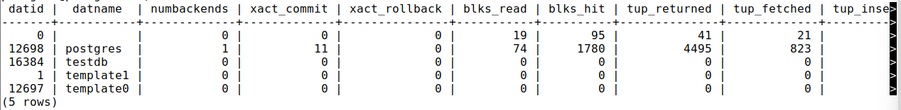
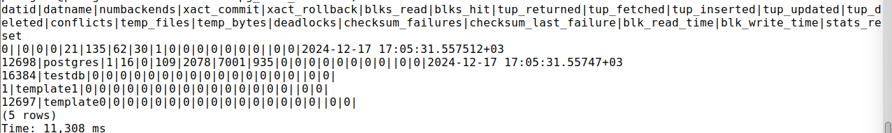
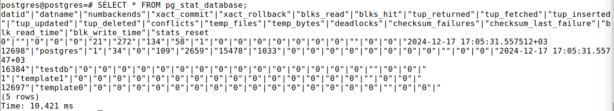

1) **psql -d testdb -U postgres**\
   Timing is on.\
   psql (13.6)\
   Type "help" for help.\
Без указания имени бд подключается по-умолчанию к базе postgres
2) **\conninfo**\
   You are connected to database "testdb" as user "postgres" via socket in "/tmp" at port "5555".\
Здесь указаны к какой бд, от имени какого пользователя, через какой сокет и к какому порту мы подключились
3) \c[onnect] {[DBNAME|- USER|- HOST|- PORT|-] | conninfo}
   connect to new database (currently "testdb")\
   \password [USERNAME]   securely change the password for a user\
   \set [NAME [VALUE]]    set internal variable, or list all if no parameters
4) **\c postgres**\
    You are now connected to database "postgres" as user "postgres"\
   \c testdb postgres localhost 5555
Первым параметром указывается бд, к которой хотим подключиться, вторым пользователь (разные пользователи могут иметь разные доступы), третьим адрес сервера, четвёртым порт для подключения который слушает сервер
5) **SELECT * FROM pg_stat_database;**\
\
**\a**\
Output format is unaligned.\
**SELECT * FROM pg_stat_database;**\

С выравниванием полей колонки в каждой строке одной ширины
6) **\pset fieldsep "|"**\
   Field separator is ""|"".\
**SELECT * FROM pg_stat_database;**\
\
\pset позволяет задать разделитель в невыравненого вывода 
7) **\set MY_VAR Hello, PostgresSql!**\
**\echo :MY_VAR**\
Hello,PostgresSql!
Переменные можно использовать в sql запросах в виде :VAR_NAME, например как часть условий в WHERE
8) **SELECT now() AS curr_time \gset**\
**\echo :curr_time**\
2024-12-17 16:48:33.647519+03
gset например может быть полезен для сохранения состояния каких-нибудь данных на начало сессии, если в процессе они могут меняться, а старое значение понадобится для других запросов
9) **\! pwd**
/home/student/postgresql-13.6
с помощью \! можно например создать файл, не выходя из postrgres или открыть файловый менеджер

Вопросы:
1) У psql нет обязательный параметров
2) \help и \?
3) \c db_name user host port
4) Выравнивание переключается командой \a и отличается выравниваем ширины колонок в строках
5) \set var_name устанавливает и \echo :var_name выводит