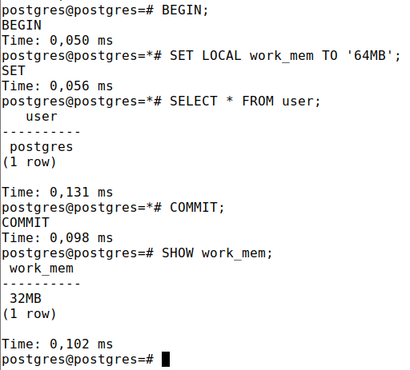
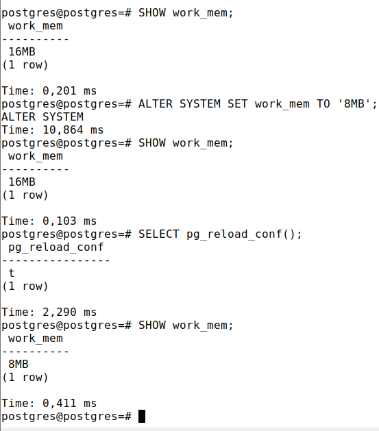
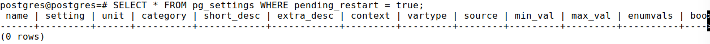

1) **SHOW config_file;**\
   config_file\
--------------------------------------------\
/home/student/pgsql13/data/postgresql.conf\
(1 row)\
В postrgres.conf хранятся глобальные значения параметров конфигурации сервера
2) **SHOW work_mem;**\
   work_mem\
----------\
4MB\
(1 row)
3) work_mem задаёт базовый максимальный объём памяти, который будет использоваться во внутренних операциях при обработке запросов (например, для сортировки или хеш-таблиц), прежде чем будут задействованы временные файлы на диске
4) **SET work_mem TO '32MB';**
**SHOW work_mem;**\
   work_mem\
----------\
32MB\
(1 row)
SET изменил локальное значение work_mem в рамках сессии 
5) **SELECT pg_reload_conf();**
Перечитывать конфиг необходимо если мы изменили значения в самом файле и хотим их применить без остановки сервера
6) **SELECT * FROM pg_settings WHERE context = 'postmaster';**\
Все эти параметры требуют перезапуска сервера для их вступления в силу
7) \
SET LOCAL устанавливает значение до конца транзакции
8) 
Значения изменились только после перечитывания конфига т.к. ALTER SYSTEM изменяет глобальные значения, но пишутся они не в postgresql.conf, а в postgresql.auto.conf
9) **SET myapp.custom_setting TO hello;**\
**SHOW myapp.custom_setting;**\
myapp.custom_setting 
10) 
После применения значения колонка pending_restart становится false

Вопросы:
1) postgresql.conf обычно находится в PG_DATA
2) SHOW param_name;
3) pg_reload_conf() перечитывает конфиг и применяет изменения, используется когда изменились глобальные значения параметров в конфигах
4) SET изменяет значение в рамках сессии или транзакции, ALTER SYSTEM изменяет глобальные значения в postgresql.auto.conf
5) В рамках сессии можно менять значения параметров со значениями superuser и user колонки context в pg_settings\
Сделать это с помощью SET для сессии или SET LOCAL для транзакции